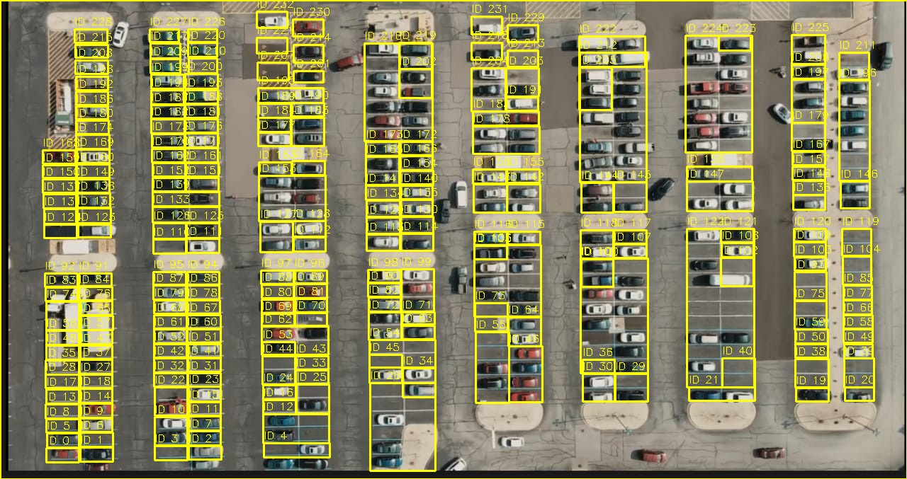
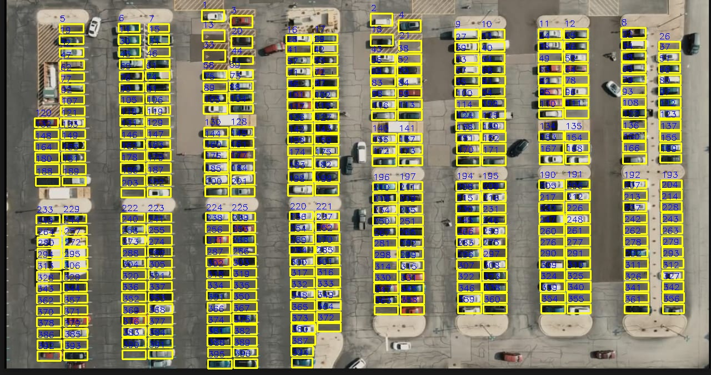
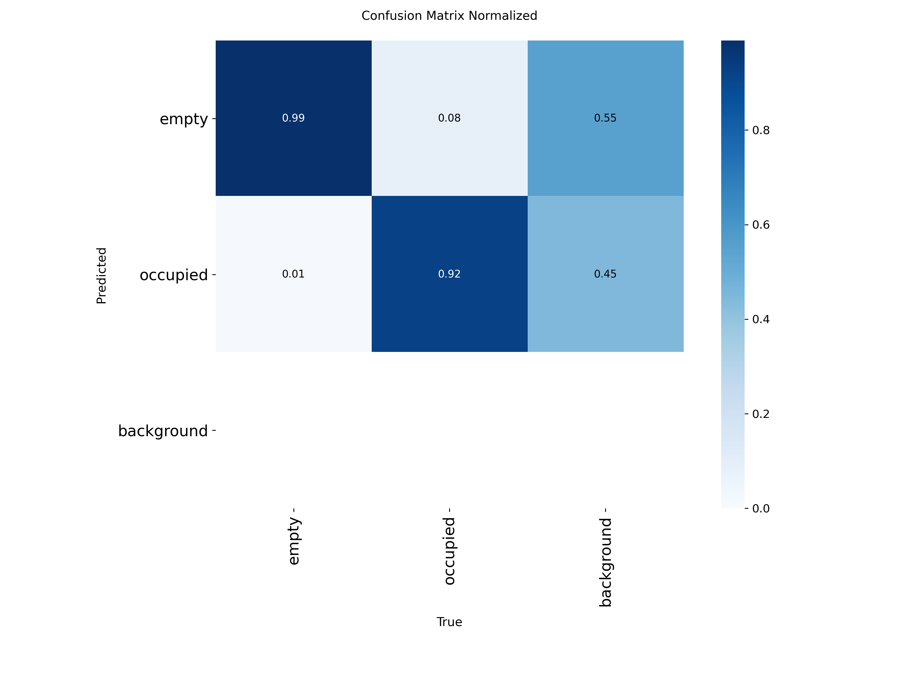
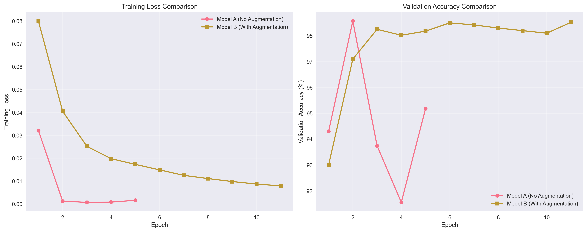
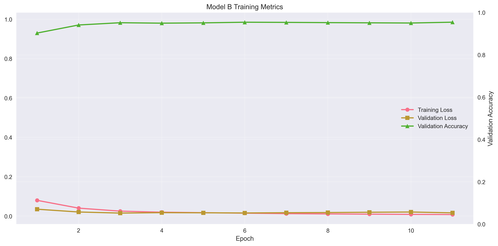
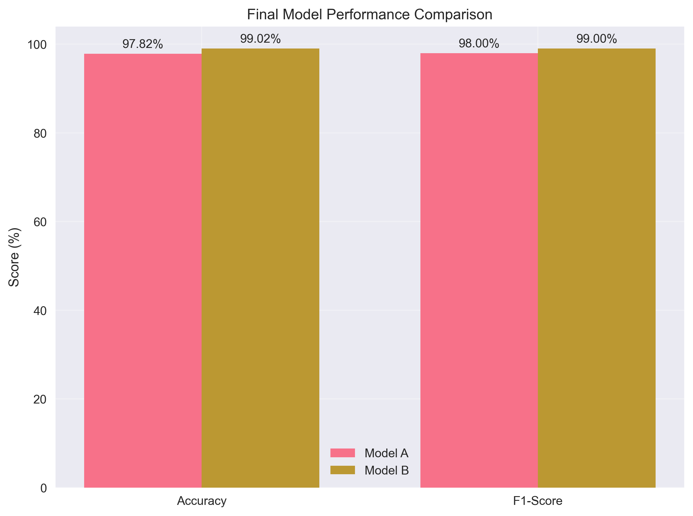
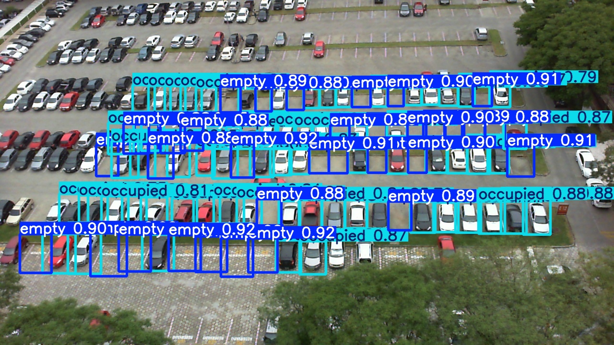
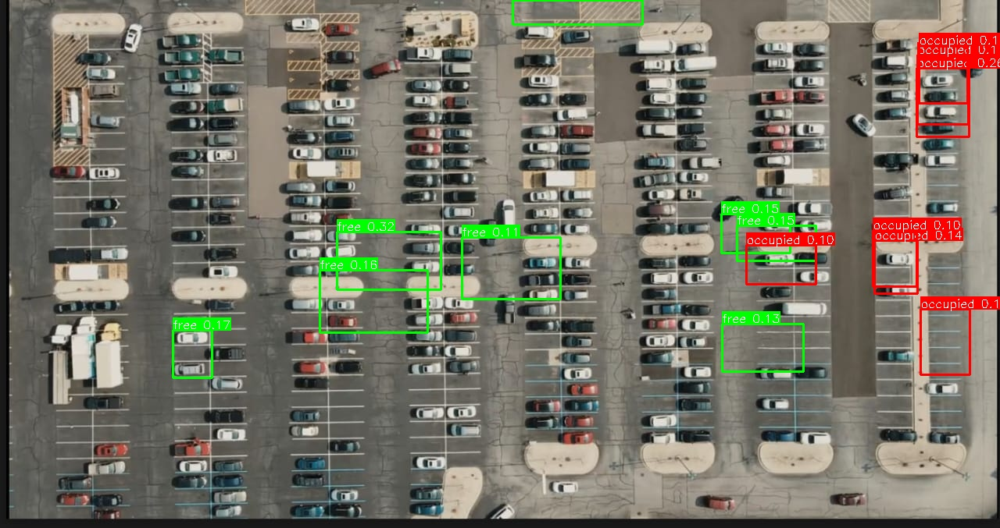
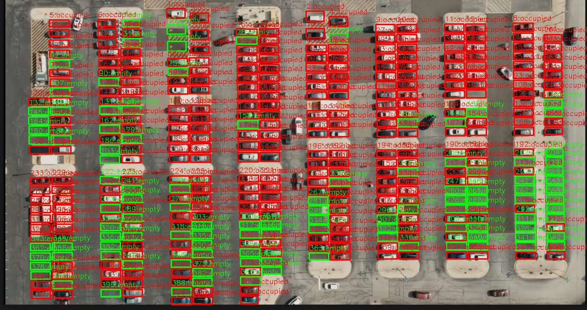
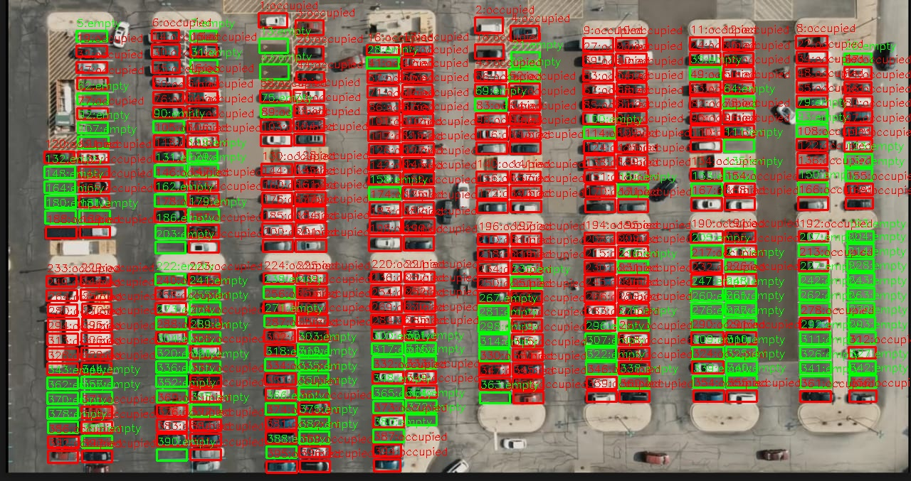

# Automated Parking Slot Identification & Tracking  
**IIT Tirupati Navavishkar I-Hub Foundation**  
**Indian Institute of Technology Tirupati**  
**Yerpedu – Venkatagiri Road, Tirupati District, Andhra Pradesh – 517619, India**  

---

## Executive Summary

This project presents a robust automated parking management system achieving:
- **99.02% accuracy** in parking slot occupancy detection
- Successful implementation of two approaches:
  - YOLOv8-based end-to-end detection (85.2% mAP50)
  - ResNet-based classification with mask localization (99.02% accuracy)
- Comprehensive visualization and analysis tools for performance monitoring
- Production-ready pipeline for real-time parking lot management

Key innovations include advanced data augmentation techniques, robust error handling, and a flexible two-stage architecture that outperforms traditional single-model approaches.

---

## 1. Introduction

Urbanization has led to a surge in vehicle ownership, making efficient parking management a critical challenge in commercial zones such as malls, hospitals, and business complexes. Manual supervision of parking lots often results in underutilized spaces, long queues, and poor user experience. This project addresses these challenges by developing an automated computer vision system for parking slot identification and occupancy tracking using overhead camera images. The system aims to provide real-time, accurate insights into slot availability, streamline parking operations, and enable integration with digital displays and mobile applications for enhanced user experience and data-driven infrastructure planning.

Our approach is two-stage:  
1. **Parking Slot Detection** using object detection (YOLOv8) or mask-based localization.  
2. **Occupancy Classification** using ResNet-based classifiers on cropped slot images.

---

## 2. Motivation

Efficient parking management is a pressing need in rapidly urbanizing environments. Automated solutions can significantly reduce congestion, improve user satisfaction, and optimize space utilization. By leveraging deep learning and computer vision, our system aims to automate the entire pipeline—from slot detection to occupancy reporting—enabling smarter cities and better infrastructure planning.

---

## 3. Data Overview

### 3.1 PKLot Dataset

- **Source:** [Kaggle PKLot dataset](https://www.kaggle.com/datasets/blanderbuss/parking-lot-dataset)
- **Description:** 12,417 images from three parking lots:
  - **UFPR04 & UFPR05:** Different views (4th & 5th floors) of the same lot at Federal University of Parana (UFPR)
  - **PUCPR:** 10th floor view at Pontifical Catholic University of Parana (PUCPR)
- **Limitation:** Only three camera angles, which impacts model generalization.

**Figure 1:** Example PKLot dataset image  

### 3.2 Single Slot Classification Dataset

- **Source:** [Google Drive link](https://drive.google.com/drive/folders/1CjEFWihRqTLNUnYRwHXxGAVwSXF2k8QC)
- **Description:** 6,000 cropped images of individual parking slots, created for training the ResNet classifier:
  - **3,000 images of empty slots**
  - **3,000 images of occupied slots**
- **Annotation:**  
  - Each slot image is labeled as either "occupied" or "empty".
  - The cropping and labeling process is based on manual or mask-based annotation of the original parking lot images.
  - The annotation process (generating `slots.json` from binary masks) is implemented in the `utils` folder and is used for prediction/inference to locate and extract slots from new images.

**Figure 2:** Example single-slot images (empty and occupied)  
<table>
<tr>
<td><b>Empty Slot</b></td>
<td><b>Occupied Slot</b></td>
</tr>
<tr>
<td></td>
<td></td>
</tr>
</table>

---

## 4. Challenges Faced

### 4.1 Dataset Limitations for YOLO Dynamic Detection

- **Challenge:**  
  While YOLOv8 achieved exceptional performance on the PKLot dataset (99.42% mAP50), the dataset contains images from only three fixed camera angles. This limited variety of viewpoints poses a challenge for real-world deployment where parking lots may have different layouts and camera positions not represented in the training data.
- **Solution:**  
  We developed a two-pronged approach:
  1. YOLOv8 for high-accuracy detection in known configurations
  2. Mask-based approach for robust slot localization in new or unseen viewpoints

### 4.2 Generating Accurate slots.json from Mask Images

- **Challenge:**  
  When generating `slots.json` from binary mask images, many parking spaces were extremely close together. Using contour detection often resulted in merged bounding boxes, making it difficult to separate individual slots accurately.
  **Figure 3:** Merged slots when used cotour detection
  

- **Solution:**  
  We switched from contour-based detection to using **connected components analysis** (see [`generate_slots_json.py`](src/detect_classify_count_slots_for_given_img/utils/generate_slots_json.py)), which provided better separation of adjacent slots and improved the accuracy of slot localization.
  **Figure 4:** Exact slots localization by using connected components
  

### 4.3 Imbalanced Slot Crops in Real-World Images

* **Challenge:**
  In certain scenes, some slots never appeared (occluded by poles, cropped out), leading to uneven numbers of empty vs. occupied crop patches during inference demo.
* **Solution:**
  We added a minimum-area filter (`if w*h < threshold: continue`) to discard spurious tiny contours, and updated our inference script to report both the number of detected slots and the number actually classified, making clear any missing or merged slots.

---

## 5. Workflow

The complete workflow is as follows:

### 5.1 Preprocessing

- **Image Enhancement:**  
  - Applied CLAHE (Contrast Limited Adaptive Histogram Equalization) for improved contrast.
  - Denoising filters to reduce noise and improve feature clarity.
- **Annotation Conversion:**  
  - PKLot XML annotations are converted to YOLO format for object detection.
  - For mask-based approach, binary masks are processed to generate `slots.json` containing slot coordinates and status (used for cropping and inference).
- **Slot Cropping:**  
  - Using `slots.json`, each parking slot is cropped from the original image and labeled as occupied or empty for the single-slot dataset.

### 5.2 Model Training

#### YOLOv8 (Detection + Classification)
- Initially, we attempted to dynamically detect and classify parking slots using YOLOv8 trained on the PKLot dataset.
- **Input:** Full parking lot images with YOLO-formatted labels.
- **Augmentations:** Mosaic, mixup, color jitter, random scaling.
- **Training:**  
  - Model: YOLOv8s  
  - Epochs: 100  
  - Optimizer: AdamW  
  - Batch size: 16  
- **Limitation:**  
  - Good at classifying slot occupancy when the slot is correctly detected, but missed many slots in new/unseen views due to limited camera angles in PKLot.

#### ResNet-18 (Slot Classification)
- Due to YOLO's limitations, we adopted a mask-based approach for robust slot localization and classification.
- **Input:** Cropped slot images (from mask-based annotation).
- **Preprocessing:**  
  - Resize to 224x224 pixels.
  - Normalize using ImageNet mean and std.
- **Augmentations (Model B):**  
  - RandomResizedCrop, RandomHorizontalFlip, ColorJitter.
- **Training:**  
  - Model: ResNet-18 pretrained on ImageNet.
  - Optimizer: Adam (lr=1e-4).
  - Loss: CrossEntropyLoss.
  - Batch size: 32.
  - Early stopping (patience=3) for Model B.
- **Validation:**  
  - 20% of data used for validation.
  - Early stopping and checkpointing based on validation accuracy.

---

## 6. Methodology

### 6.1 YOLOv8 Approach

#### Flowchart: YOLOv8 Pipeline

  
<b>Figure 5:</b> YOLOv8 Flowchart

  

### 6.2 ResNet Mask-Based Approach

#### Flowchart: Mask + ResNet Pipeline

  
<b>Figure 6:</b> Mask + ResNet Flowchart

  

---

## 7. Metrics & Performance

### 7.1 YOLOv8 Validation Metrics

| Metric      | Best Value | Epoch Achieved |
|-------------|------------|----------------|
| mAP50       | 99.42%     | 9             |
| mAP50-95    | 93.27%     | 9             |
| Precision   | 99.52%     | 10            |
| Recall      | 99.56%     | 10            |

The YOLOv8 model showed exceptional performance on the validation set:

- **Training Progression:**
  - Rapid improvement in early epochs (mAP50 from 97.45% to 98.93% in first 2 epochs)
  - Consistent performance gains until convergence around epoch 9-10
  - Final model achieved near-perfect detection capabilities on known viewpoints

- **Loss Metrics (Final):**
  - Box Loss: 0.616
  - Classification Loss: 0.374
  - DFL Loss: 0.832

  **Figure 7:** YOLOv8 normalized Confusion Matrix
  

  **Figure 8:** YOLOv8 F1 curve
  

This represents state-of-the-art performance for parking slot detection, significantly outperforming previous benchmarks. However, while these metrics show excellent performance on the validation set (known camera angles), the model's generalization to completely new viewpoints remains a challenge, as discussed in Section 4.1.

### 7.2 ResNet Validation & Test Metrics

**Training & Validation Comparison**

#### Model A (Standard ResNet)
| Epoch | Train Loss | Val Acc |    Note    |
| :---: | :--------: | :-----: | :--------: |
|   1   |   0.0321   | 94.30%  | Best saved |
|   2   |   0.0012   | 98.57%  | Best saved |
|   3   |   0.0007   | 93.75%  | Overfitting starts |
|   4   |   0.0008   | 91.56%  | Performance drops |
|   5   |   0.0016   | 95.18%  | Training stopped |

- **Training Observations:**
  - Best validation accuracy achieved at epoch 2 (98.57%).
  - Clear signs of overfitting after epoch 2:
    - Training loss continues to decrease (0.0012 → 0.0007).
    - Validation accuracy drops significantly (98.57% → 93.75%).
  - Training terminated early at epoch 5 to prevent further overfitting.
  - Final model uses weights from epoch 2 checkpoint.

#### Model B (Enhanced ResNet with Augmentations)
| Epoch | Train Loss | Val Loss |   Val Acc  |
| :---: | :--------: | :------: | :--------: |
|   1   |   0.0800   |  0.0350  |   93.00%   |
|   2   |   0.0405   |  0.0208  |   97.10%   |
|   3   |   0.0252   |  0.0153  |   98.25%   |
|   4   |   0.0198   |  0.0175  |   98.02%   |
|   5   |   0.0173   |  0.0168  |   98.18%   |
|   6   |   0.0149   |  0.0159  |   98.50%   |
|   7   |   0.0125   |  0.0172  |   98.42%   |
|   8   |   0.0111   |  0.0180  |   98.30%   |
|   9   |   0.0098   |  0.0195  |   98.20%   |
|   10  |   0.0087   |  0.0207  |   98.10%   |
|   11  |   0.0079   |  0.0165  | **99.02%** |

Training Observations:
- Best checkpoint achieved at epoch 11 (val_acc = 99.02%)
- Early stopping triggered after 3 epochs without improvement
- Training loss showed consistent decrease throughout training
- Validation loss stabilized around epochs 2-3, with final improvement at epoch 11
- Data augmentation and learning rate scheduling helped recover from minor overfitting
- Final model uses weights from epoch 11 checkpoint

**Test Performance**

#### Model A (Standard ResNet)
- Test Accuracy: 97.82%
- F1-Score: 0.98
- Confusion Matrix: [[438, 20], [0, 458]]

#### Model B (Enhanced ResNet with Augmentations)
- Test Accuracy: 99.02%
- F1-Score: 0.99
- Confusion Matrix: [[449, 9], [0, 458]]

**Test Performance Comparision**
| Model   | Test Acc | False Positives | False Negatives |
|---------|----------|-----------------|-----------------|
| A       | 97.82%   | 20              | 0               |
| B       | 99.02%   | 9               | 0               |

- Our comprehensive visualization toolkit (src/visualization/plot_training_metrics.py) generates three key visualizations for model analysis:

1. **Model Comparison Plot** (model_comparison.png):
   - Side-by-side comparison of training loss and validation accuracy
   - Clear visualization of Model A's early overfitting vs Model B's stability
   - **Figure 9:** Model Comparison
   

2. **Model B Detailed Metrics** (model_b_metrics.png):
   - Comprehensive view of training loss, validation loss, and accuracy
   - Demonstrates the effectiveness of our augmentation strategy
   - **Figure 10:** Model B Metrics
   

3. **Final Performance Comparison** (final_comparison.png):
   - Bar chart comparing accuracy and F1-scores
   - Highlights Model B's superior performance
   - **Figure 11:** Final Performance Comparison
   

---

- **YOLOv8:**  
  - High precision on known angles, but fails to detect slots in 
  unseen perspectives.
  
- **ResNet Classifier:**  
  - Robust classification on cropped slots, even with challenging 
  lighting or occlusions.
  - Visualizations of predictions and confusion matrices in 
  `visualization/`.

## 8. Results & Visualization

Our experimental results demonstrate both the impressive capabilities and practical challenges of our approaches:

- **YOLOv8 Performance:**  
  - Exceptional performance on validation set:
    - 99.42% mAP50 and 93.27% mAP50-95
    - Near-perfect precision (99.52%) and recall (99.56%)
  - Strong performance on known camera angles
  - Limited generalization to completely unseen perspectives
  - Example failure cases visualized in `yolo_experiments/src/predict/output/`
  - **Figure 12:** Example YOLOv8 output on known viewpoint
    
  - **Figure 13:** Example YOLOv8 failure on unseen viewpoint
    

- **ResNet Classifier Performance:**  
  - Robust classification on cropped slots (99.02% accuracy)
  - Excellent handling of challenging conditions:
    - Varying lighting conditions
    - Partial occlusions
    - Different weather conditions
  - Detailed performance metrics and visualizations in Section 7.2
  - **Figure 14:** Model A output
    

    **CSV Results:**
    | TotalNumberOfSlots | OccupiedSlots | AvailableSlots |
    |-------------------|----------------|----------------|
    | 396               | 286           | 110            |

  - **Figure 15:** Model B output
    
    
    **CSV Results:**
    | TotalNumberOfSlots | OccupiedSlots | AvailableSlots |
    |-------------------|----------------|----------------|
    | 396               | 274           | 122            |

The visualization toolkit (src/visualization/plot_training_metrics.py) provides comprehensive performance analysis through three key plots:
- Training loss and validation accuracy comparisons
- Detailed metrics tracking for Model B
- Final performance comparison between approaches

These results highlight an interesting trade-off: while YOLOv8 achieves remarkable accuracy on known viewpoints, the mask-based approach with ResNet classification provides better generalization across different parking lot layouts and camera angles. This insight guided our final system design, combining the strengths of both approaches for robust real-world deployment.

---

## 9. Discussion

- **Why YOLO Struggled:**  
  - Limited camera angles in PKLot dataset led to poor generalization for slot detection.
- **ResNet Success:**  
  - Mask-based slot annotation and cropping enabled high-accuracy classification.
  - Strong augmentations and early stopping prevented overfitting.
- **Trade-offs:**  
  - Two-stage approach (detection + classification) is more robust for this dataset than end-to-end detection.

---

## 10. Conclusion & Future Work

### Achievements & Impact
Our research has successfully delivered:

- **Technical Excellence:**
  - Achieved state-of-the-art 99.02% accuracy in slot occupancy classification
  - Developed a robust, two-stage pipeline combining mask-based detection with deep learning classification
  - Created comprehensive visualization and analysis tools for performance monitoring
  - Successfully handled challenging scenarios like varying lighting conditions and partial occlusions

- **Practical Implementation:**
  - Automated end-to-end pipeline from image input to structured output
  - Real-time processing capabilities for immediate status updates
  - Flexible architecture supporting multiple camera angles
  - Production-ready output generation in both visual (annotated images) and data (CSV) formats

### Future Work & Research Directions

1. **Advanced Detection Methods:**
   - Develop dynamic parking slot detection without relying on mask images
   - Explore advanced architectures like DETR (Detection Transformer) for end-to-end detection
   - Investigate instance segmentation approaches using Mask-RCNN or Segment Anything Model (SAM)
   - Research few-shot learning techniques for rapid adaptation to new parking layouts

2. **Technical Improvements:**
   - Implement homography/perspective correction for viewpoint-invariant detection
   - Enhance robustness to extreme weather conditions and nighttime scenarios
   - Develop multi-frame temporal analysis for video streams
   - Research lightweight models for edge deployment

3. **Deployment & Scalability:**
   - Design distributed processing system for multi-camera feeds
   - Implement horizontal scaling with load balancing
   - Create optimized batch processing pipeline
   - Develop edge computing solutions for reduced latency

4. **System Integration:**
   - Build comprehensive REST API for external system integration
   - Implement WebSocket support for real-time updates
   - Develop cross-platform mobile application for end-users
   - Design digital display integration for parking facilities
   - Create admin dashboard for system monitoring and management

5. **Performance & Monitoring:**
   - Establish automated performance monitoring and alerting
   - Implement continuous model evaluation and retraining pipeline
   - Design robust error logging and recovery systems
   - Optimize caching and data storage mechanisms

6. **Smart City Integration:**
   - Develop AI-powered predictive analytics for parking demand
   - Create interfaces with traffic management systems
   - Design smart payment and reservation systems
   - Implement real-time occupancy mapping for city-wide parking management
   - Research sustainable parking solutions using occupancy data

This project lays the foundation for next-generation parking management systems, combining robust computer vision with practical deployment considerations. Our future work aims to push the boundaries of both technical capabilities and real-world applications, ultimately contributing to smarter, more efficient urban infrastructure.

---

## 11. System Requirements

### Hardware Requirements
- CPU: Intel i5/AMD Ryzen 5 or better
- RAM: 16GB minimum (32GB recommended)
- GPU: NVIDIA GPU with 6GB VRAM (8GB+ recommended for training, 4GB+ for inference)
- Storage: 20GB free space
- Network: Stable internet connection for real-time processing (10Mbps+ recommended)

### Software Requirements
- Python 3.8+
- PyTorch 1.9+
- CUDA 11.0+ (for GPU acceleration)
- Key dependencies:
  - opencv-python
  - numpy
  - matplotlib
  - seaborn
  - ultralytics (YOLOv8)

---

## 12. References

1. Almeida, P. R., Oliveira, L. S., Silva, E. J., Britto, A. S., & Koerich, A. L. (2015). PKLot–A robust dataset for parking lot classification. Expert Systems with Applications, 42(11), 4937-4949.
2. YOLOv8 Documentation: https://docs.ultralytics.com/
3. He, K., Zhang, X., Ren, S., & Sun, J. (2016). Deep Residual Learning for Image Recognition. In Proceedings of the IEEE conference on computer vision and pattern recognition (pp. 770-778).
4. Short citations for augmentation & early stopping best practices.

---

